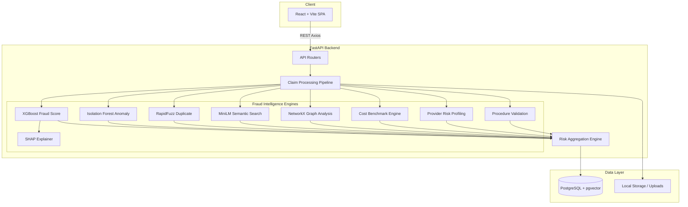
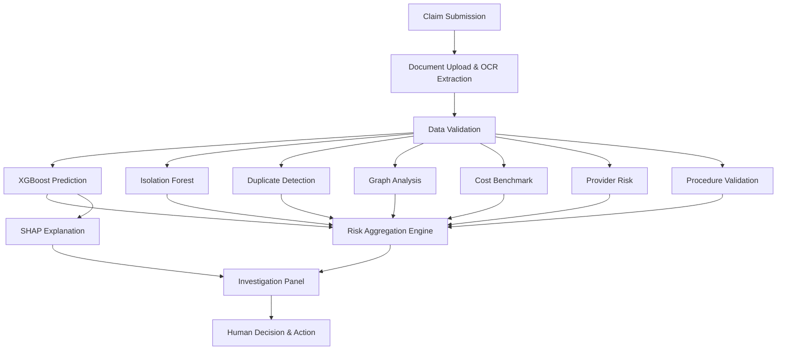

# AURA — Automated Risk & Audit Analyzer

> **AURA is an explainable multi-engine healthcare claim fraud investigation platform that combines OCR validation, supervised fraud prediction, anomaly detection, duplicate analysis, semantic similarity, graph relationships, provider risk profiling, cost benchmarking, and explainable AI into a unified investigation workflow.**

---

## 📌 Problem Statement
Healthcare claim fraud costs billions annually, but traditional rule-based systems often struggle with sophisticated fraud patterns and lack the contextual intelligence needed by investigators. High treatment costs are frequently flagged as fraud without considering provider risk, region, or procedure benchmarks. Furthermore, black-box AI models fail to provide investigators with the reasoning behind a high fraud score, leading to a lack of trust and operational bottlenecks.

## 💡 Solution
AURA addresses these challenges through a **Risk Aggregation Engine** that intelligently combines multiple independent signals. Instead of relying solely on one machine learning model, AURA evaluates each claim across several dimensions (anomaly, cost, duplicate, graph, and fraud probability) and provides a **SHAP-powered Explainable AI (XAI)** interface, allowing human investigators to make confident, data-driven decisions.

---

## 🚀 Key Features

### 1. Claim Intake and OCR
Upload medical claims manually or in bulk. AURA extracts structured text using **EasyOCR** (with PyTesseract fallback) to validate against submitted structured data.

### 2. Fraud Probability & Anomaly Detection
Uses a trained **XGBoost** classifier to predict fraud probability based on historical patterns, and an **Isolation Forest** model to detect novel, out-of-distribution anomalies that might bypass supervised models.

### 3. Duplicate Detection & Semantic Similarity
Prevents double-billing by comparing incoming claims against historical data using **RapidFuzz** (for exact/fuzzy matching) and **SentenceTransformers** (for semantic vector similarity).

### 4. Graph-Based Relationship Analysis
Constructs a knowledge graph using **NetworkX** to detect suspicious entity relationships (e.g., patient-provider clusters that frequently submit high-risk claims).

### 5. Provider Risk & Cost Benchmarking
Maintains a rolling risk profile for healthcare providers. Claims are evaluated against a **Cost Benchmark Engine** that flags procedures deviating from historical interquartile ranges (IQR) for a specific provider and region.

### 6. Risk Aggregation & SHAP Explainability
Combines 6 normalized risk scores into a unified Aggregate Risk Score. Uses **SHAP (SHapley Additive exPlanations)** to break down exactly which features contributed to the XGBoost fraud prediction, making the AI fully transparent.

### 7. Investigation Workflow & Automated PDF Reports
Provides a complete UI for investigators to review claims, update statuses, leave notes, and assign cases with SLA deadlines. Automatically generates downloadable **PDF Audit Reports** using ReportLab.

---

## 🏗 Architecture Diagram



## 🔍 Fraud Analysis Pipeline



### 🧠 Understanding Risk Aggregation
AURA combines multiple independent risk signals. The **Final Aggregate Score** is a configurable, weighted combination of normalized component scores (Fraud, Anomaly, Duplicate, Graph, Cost, Provider). This ensures that a high treatment cost alone does not automatically establish fraud if the provider risk is low and the procedure is historically expensive.

---

## 💻 Technology Stack

*   **Frontend**: React 19, Vite, Tailwind CSS, Axios, Chart.js
*   **Backend**: FastAPI, SQLAlchemy, Pydantic
*   **Database**: PostgreSQL with `pgvector` (SQLite for local dev/testing)
*   **Machine Learning**: XGBoost, scikit-learn (Isolation Forest), SentenceTransformers (all-MiniLM-L6-v2)
*   **Explainability**: SHAP
*   **OCR**: EasyOCR, PyTesseract
*   **Similarity & Graph**: RapidFuzz, NetworkX
*   **DevOps & Testing**: Docker, Docker Compose, GitHub Actions, Pytest, Vitest

---

## 📸 Screenshots
*(Note: Replace placeholder links with actual repository screenshot paths)*
*   **Dashboard**: `docs/screenshots/dashboard.png`
*   **Claims Register**: `docs/screenshots/claims_register.png`
*   **Investigation Panel (with SHAP)**: `docs/screenshots/investigation_panel.png`
*   **Bulk Upload**: `docs/screenshots/bulk_upload.png`
*   **Cost Benchmarks**: `docs/screenshots/cost_benchmarks.png`

---

## 📁 Project Structure

```text
auraaaaa/
├── backend/
│   ├── alembic/            # Database migrations
│   ├── app/
│   │   ├── models/         # SQLAlchemy core schemas
│   │   ├── routers/        # FastAPI endpoints (claims, auth, admin, etc.)
│   │   └── services/       # ML pipeline, aggregation, risk, drift services
│   ├── ml_models/          # Persisted XGBoost, IsoForest, and Feature artifacts
│   └── tests/              # Comprehensive Pytest suite (ML validation, security)
├── frontend/
│   ├── src/
│   │   ├── components/     # React UI components (Charts, Modals, Forms)
│   │   └── pages/          # Views (Login, ClaimsList, ClaimDetail, Dashboards)
├── docker-compose.yml      # Multi-container deployment config
└── .github/workflows/      # CI/CD pipelines
```

---

## ⚙️ Setup Instructions

### Option A: Docker Setup (Recommended)
This spins up the Frontend, Backend, and PostgreSQL with pgvector natively.

```bash
git clone https://github.com/yourusername/auraaaaa.git
cd auraaaaa
cp .env.example .env
docker compose up -d --build
```
*   **Frontend**: `http://localhost:5173`
*   **Backend API**: `http://localhost:8000/docs`

### Option B: Manual Development Setup

**1. Backend**
```bash
cd backend
python -m venv .venv
source .venv/bin/activate  # Or .venv\Scripts\activate on Windows
pip install -r requirements.txt
cp ../.env.example .env
uvicorn app.main:app --reload
```

**2. Frontend**
```bash
cd frontend
npm install
npm run dev
```

---

## 🔐 Environment Variables

Copy `.env.example` to `.env` in the root directory.

| Variable | Purpose | Required/Optional |
| :--- | :--- | :--- |
| `DATABASE_URL` | SQLAlchemy connection string | Required |
| `JWT_SECRET_KEY` | Secret for signing Auth tokens | Required |
| `SMTP_HOST`, `SMTP_PORT`, `SMTP_USER`, `SMTP_PASS`, `SMTP_FROM` | Mailtrap/SMTP config for email notifications | Optional (has safe fallback) |
| `GEMINI_API_KEY` | Used for generative LLM summaries | Optional (has safe fallback) |

---

## 🧪 Testing

AURA includes a robust test suite covering security, workflow, ML model constraints, and data drift.

**Run Backend Tests:**
```bash
cd backend
pytest tests/ -v
```

**Run Frontend Tests:**
```bash
cd frontend
npm run test
```

---

## ⚠️ Limitations & Project Context

*   **Synthetic Data**: The ML models in this repository are trained on synthetic healthcare claim datasets. While the architecture and inference pipelines represent real-world patterns, the model predictions are not clinically or financially validated for real patient data.
*   **Not a Medical Decision System**: AURA is a technical portfolio project and research prototype designed to showcase complex system architecture, ML integration, and DevOps practices. It does not possess regulatory compliance (e.g., HIPAA) for processing live Protected Health Information (PHI).
*   **Scale**: At extreme production scales (>10M claims), the current in-memory NetworkX graph and `pgvector` indexing strategies would need to be migrated to dedicated graph databases and distributed vector stores.

---

## 🔮 Future Scope
*   **Cloud Object Storage**: Migrate local filesystem evidence uploads (`uploads/`) to AWS S3 / GCS.
*   **Advanced Orchestration**: Extract background tasks into a dedicated Celery/Redis worker cluster.
*   **Graph Database**: Replace NetworkX with Neo4j to compute complex multi-hop fraud rings in real-time.

---
*Built as a comprehensive demonstration of Full-Stack Engineering, Machine Learning Operations (MLOps), and System Architecture.*
