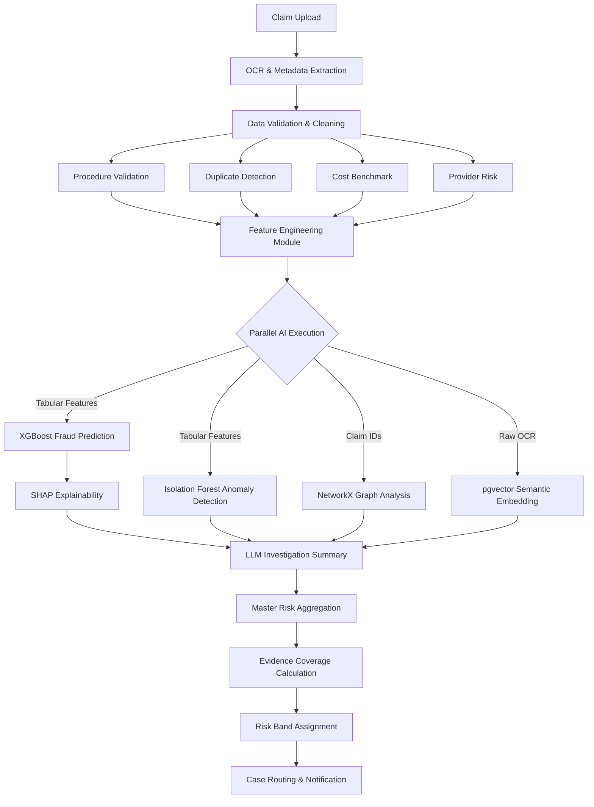

# AURA Enterprise Fraud Pipeline Architecture

## Architecture Diagram & Data Flow

The AURA pipeline is structured into a strictly ordered, enterprise-grade data workflow. It transitions from raw data extraction, to validation, to feature engineering, and finally executes heavy ML workloads in parallel before aggregating risk.

## Feature Engineering Flow
All signals generated sequentially in the first phase are merged into a unified feature dictionary.
To preserve existing model architectures, XGBoost and Isolation Forest are securely passed only the subset of features they were originally trained on, preventing regression while allowing future model retraining to leverage the new signals.

## Evidence Coverage
Evidence Coverage is a confidence indicator (calculated as a percentage, e.g., `83%`), reflecting how many pipeline components successfully gathered data for a specific claim. It tracks:
- OCR Success
- Procedure Validation Availability
- Historical Benchmark Availability
- Provider History Availability
- Successful ML Execution

## Routing Workflow
1. **Low Risk** (Score < 40%) -> Automatically Approved
2. **Medium Risk** (Score 40% - 75%) -> Manual Review Required
3. **High Risk** (Score > 75%) -> Action Required (Immediate SLA triggers)
4. **Hard Failures** (e.g., Invalid Procedure Code) -> Automatically Rejected
